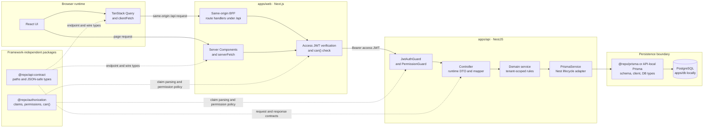
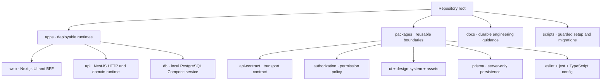
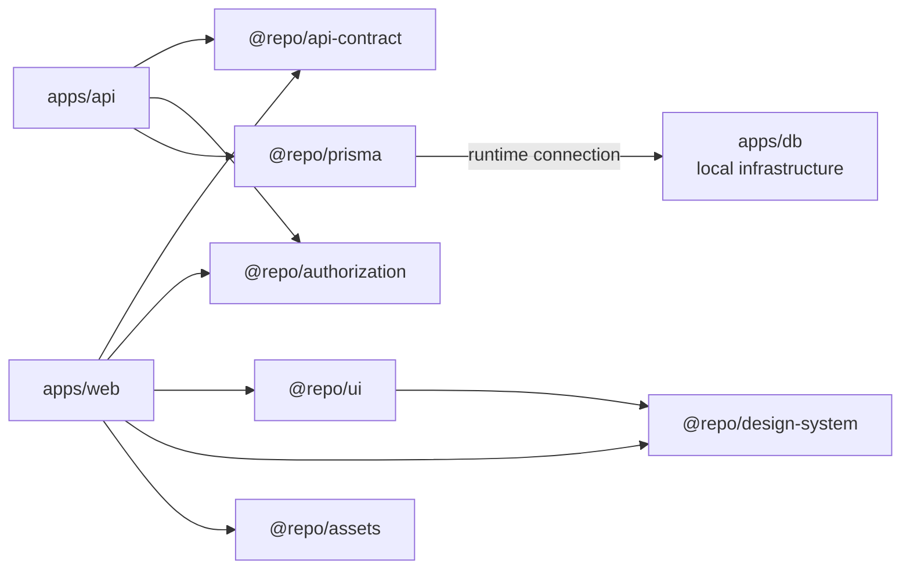
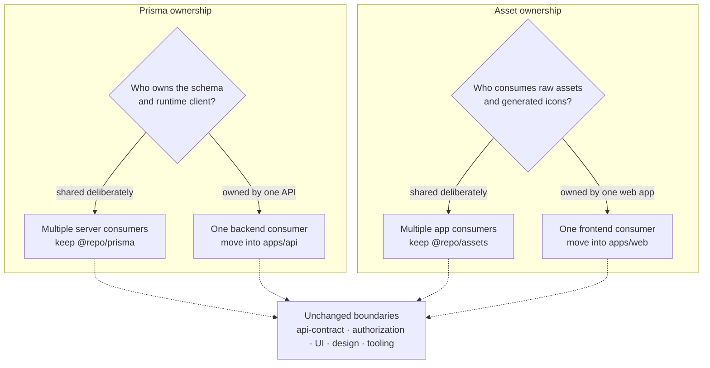
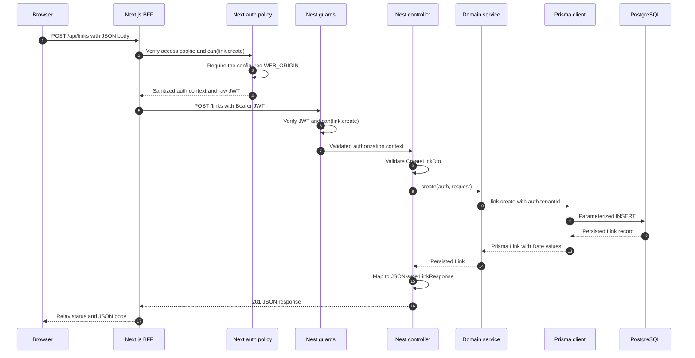
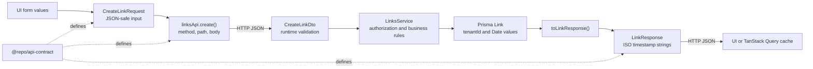
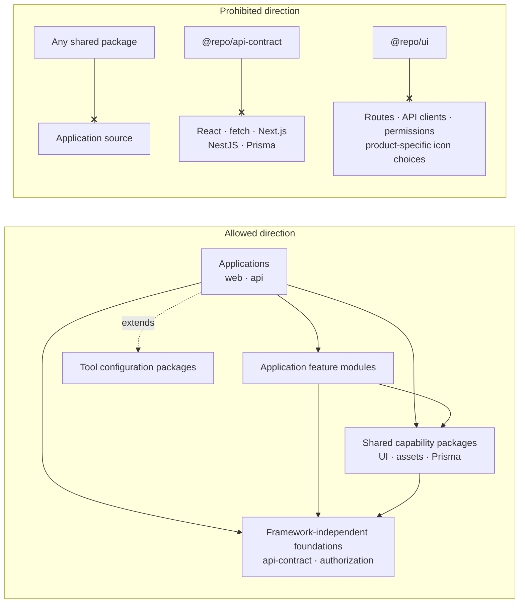

# Architecture and Modules

## System overview



Client-side calls enter Nest through the same-origin BFF. Server Components may call the internal API directly through `serverFetch()`, but they perform the same Next-side access-token verification and named-permission check first. Responses travel back along the same path.

The frontend and backend share the meaning of an HTTP request and response. They do not share database records, framework handlers, fetch clients, or UI state. The dotted arrows above are compile-time contract or policy dependencies; the solid arrows are runtime request and persistence paths.

## Default repository structure



The repository is organized by runtime ownership first and reusable responsibility second. Applications may consume packages; packages must never reach back into application code.

```text
apps/
  web/                       Next.js App Router application
    app/                     routes, layouts, BFF route handlers
    components/              components shared by unrelated routes
    data-access/             feature fetch functions and query hooks
    lib/                     app infrastructure such as auth and fetch
    providers/               app-wide React providers
  api/                       NestJS application
    src/<feature>/           controller, DTO, mapper, service, module, tests
    src/auth/                authentication and Nest guards
    src/prisma/              Nest adapter for the shared Prisma client
  db/                        local PostgreSQL Compose service
packages/
  api-contract/              framework-free HTTP contracts
  assets/                    shared raw assets and generated SVG components
  authorization/             permission vocabulary and pure evaluation
  design-system/             tokens, Tailwind theme, and shared styles
  prisma/                    server-only schema, seed, client, and DB types
  ui/                        reusable React controls and form adapters
  eslint-config/             shared lint presets
  jest-config/               shared Jest presets
  typescript-config/         shared TypeScript presets
docs/                        durable architecture and engineering guidance
scripts/                     operational and guarded migration utilities
```

This is the default shared-package layout. The template also supports moving Prisma ownership into `apps/api`, moving asset ownership into `apps/web`, or applying both changes. These ownership choices change where implementation files and build tools live; they do not change the API contract, authorization, database-runtime, or application boundaries.

### Default module dependencies

Arrows point from a consumer to the package or runtime it depends on. Configuration-only dependencies are omitted so the runtime and architectural boundaries remain visible.



There is intentionally no application-to-application source import. `apps/web` reaches `apps/api` over HTTP, and `apps/api` reaches PostgreSQL through Prisma. `@repo/api-contract` describes that HTTP boundary without depending on either application.

## Supported ownership variants

Prisma and asset localization are independent ownership decisions. They move source files, generators, dependencies, and scripts; they do not collapse the web, API, or database runtime boundaries.



### API-owned Prisma

Use API-owned Prisma when one backend owns its database schema and independent deployment or maintenance is more valuable than sharing persistence infrastructure with another backend.

```text
apps/
  api/
    prisma.config.ts         Prisma CLI configuration
    prisma/
      schema.prisma          database model
      seed.ts                seed entry point
    src/prisma/
      prisma.client.ts       runtime Prisma client construction
      prisma.service.ts      Nest lifecycle adapter
packages/
  prisma/                    removed
```

The runtime path becomes:

```text
Nest controller -> service -> PrismaService -> API-local Prisma client -> PostgreSQL
```

In this structure:

- `apps/api/package.json` owns the Prisma, PostgreSQL adapter, seed, and generation dependencies and scripts.
- Root database commands delegate to the `api` workspace instead of `@repo/prisma`.
- API persistence imports use the local client or `@prisma/client`; `apps/web` still never imports Prisma.
- `@repo/api-contract` remains JSON-safe and persistence-independent.
- The schema, client, and seed can move only when no other workspace consumes `@repo/prisma`.

Run `npm run prisma:localize:api` to preview this structure and add `-- --apply` to create it. The migration moves source ownership and refreshes workspace dependencies; it does not change PostgreSQL data. See [Localize shared infrastructure](scripts-and-template-customization.md#localize-shared-infrastructure) for the guarded workflow.

### Web-owned assets

Use web-owned assets when one frontend owns all product imagery and icons and no other workspace needs the raw files or generated icon components.

```text
apps/
  web/
    assets/
      .svgrrc.cjs            app-local SVG generation configuration
      brand/                 raw brand assets, when present
      illustrations/         raw illustrations, when present
      images/                raw images, when present
      icons/
        source/              source SVG files
        generated/           generated React components
        index.ts             generated icon exports
    scripts/
      generate-web-icons-index.mjs
packages/
  assets/                    removed
```

In this structure:

- Web imports change from `@repo/assets/...` to the `@/assets/...` app alias.
- `apps/web/package.json` owns SVGR dependencies and generates assets before development, builds, linting, type checks, and tests.
- `@repo/ui` and `@repo/design-system` stay shared; only raw asset and icon ownership moves.
- Generated icon components remain generated output and must not be edited by hand.
- Assets can move only when no workspace other than `apps/web` consumes `@repo/assets`.

Run `npm run assets:localize:web` to preview this structure and add `-- --apply` to create it. The migration copies the current raw and generated assets, rewrites web imports, removes `packages/assets`, and refreshes workspace dependencies.

### Combined localized structure

The two migrations are independent and may both be applied. The resulting repository keeps persistence inside `apps/api` and visual assets inside `apps/web` while retaining shared contracts, authorization vocabulary, UI controls, design tokens, and tool configuration.

```text
apps/
  web/                       Next.js app plus app-local assets
  api/                       NestJS app plus app-local Prisma schema/client
  db/                        local PostgreSQL Compose service
packages/
  api-contract/              shared HTTP contract
  authorization/             shared permission vocabulary and evaluation
  design-system/             shared visual tokens and styles
  ui/                        shared controls and form adapters
  eslint-config/             shared lint policy
  jest-config/               shared test policy
  typescript-config/         shared TypeScript policy
```

Choose ownership based on actual consumers:

| Concern | Keep shared when                                                                 | Localize when                                                               |
| ------- | -------------------------------------------------------------------------------- | --------------------------------------------------------------------------- |
| Prisma  | Multiple server applications intentionally share one schema and client boundary. | One API owns the schema, migrations, seed, and runtime client.              |
| Assets  | Multiple applications reuse the same files or generated icons.                   | One web application owns every asset consumer and its generation lifecycle. |

Apply localization before duplicating an app when each copy should receive independent Prisma or asset ownership. Duplicate first when the resulting applications should continue consuming the same shared package.

## Application responsibilities

### Protected request execution flow

The sequence below shows a protected browser mutation. A read follows the same path without the same-origin mutation check.



Nest guards and tenant-scoped service queries remain authoritative. The Next checks reject invalid traffic earlier and protect the browser-facing boundary, but they do not replace API authorization. Server Components skip the browser BFF hop and call the internal API through `serverFetch()` after equivalent Next-side verification.

### `apps/web`

- Renders routes and owns user interaction.
- Owns server/client fetch implementations and TanStack Query policy.
- Uses same-origin BFF handlers for protected browser traffic.
- Converts wire values when the UI needs richer types, for example an ISO timestamp to `Date`.
- Never imports `@repo/prisma` or `@prisma/client`.

### `apps/api`

- Owns HTTP controllers, runtime validation, Swagger decorators, authorization enforcement, and business operations.
- Maps persistence records to shared response contracts.
- Keeps tenant and ownership filters in authoritative Prisma queries.
- Uses `@repo/prisma` in the default layout or owns its Prisma schema/client directly after localization.
- Returns intentional HTTP errors instead of leaking database exceptions.

### `apps/db`

- Owns only local PostgreSQL infrastructure.
- Does not own the Prisma schema or application migrations.
- Must not be treated as a production deployment definition.

## Package responsibilities

### Contract and data-shape boundaries

The same feature has different representations at each boundary. Types may share field names, but persistence records and public response contracts are not interchangeable.



Runtime DTO classes implement request contracts so Nest can validate incoming JSON and generate Swagger metadata. Controllers explicitly map Prisma results into response contracts; this prevents database-only fields and runtime-specific values such as `Date` from leaking into the transport boundary.

### `@repo/api-contract`

Contains paths, methods, request types, response types, and framework-neutral endpoint descriptions. It may not import React, fetch, Next.js, NestJS, Prisma, or database runtimes.

### `@repo/prisma` (default shared ownership)

Contains the schema, seed, Prisma CLI configuration, runtime client, and generated database types. It is server-only. A Prisma type describes storage; it is not a promise to API consumers.

### `@repo/authorization`

Contains stable permission names, claim parsing, sanitized authorization context, and pure permission evaluation. JWT signing, cookies, Nest guards, and database ownership checks stay in applications.

### `@repo/design-system`

Contains visual tokens and shared CSS foundations. Add a value here when multiple apps should express the same brand/system decision, not for one page's layout.

### `@repo/ui`

Contains company-wide controls and form adapters. Components accept content and icon slots from callers. They must not choose product copy, routes, permissions, API calls, or feature-specific icons.

### `@repo/assets` (default shared ownership)

Contains visual files reused by applications. Raw files use purpose-based exports such as `@repo/assets/brand/...`; SVG glyphs are generated into React components and imported from `@repo/assets/icons`.

### Configuration packages

`eslint-config`, `jest-config`, and `typescript-config` centralize tool policy. Applications may extend them, but should not silently weaken shared correctness rules.

## Dependency direction



When a shared package needs an app import, the responsibility is in the wrong layer. When a contract needs Prisma or framework types, the public boundary has become coupled to an implementation detail.
