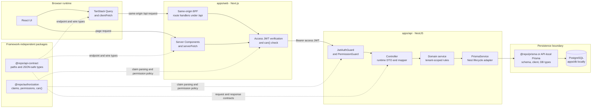
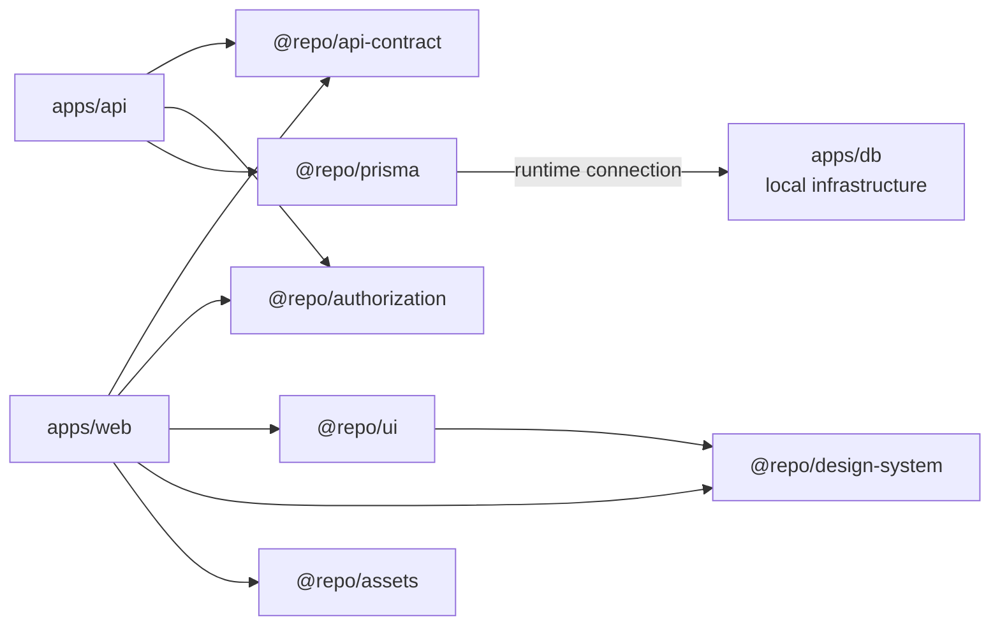
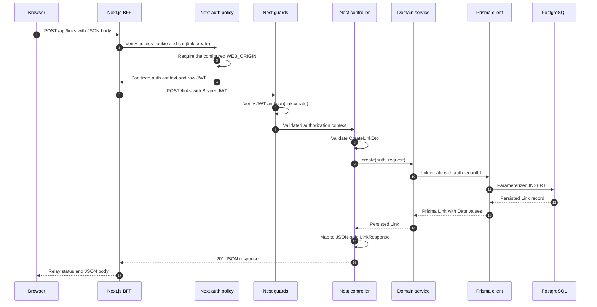
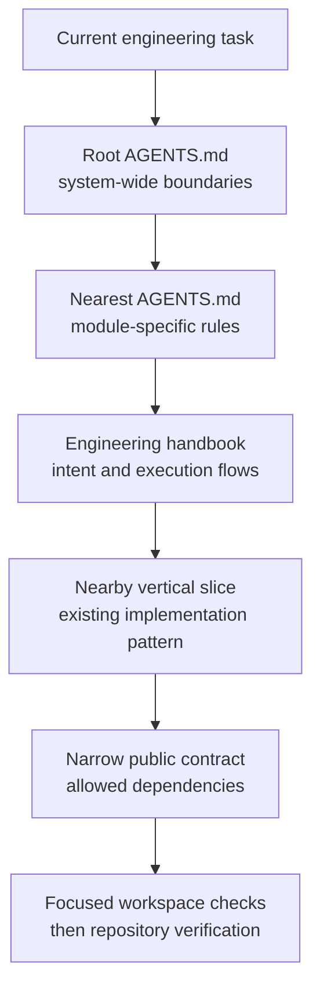

# Project Overview

The Monex Turbo Starter Template is a full-stack TypeScript monorepo built around
clear runtime boundaries and explicit ownership. It combines a Next.js web
application, a NestJS API, Prisma, PostgreSQL, and a set of focused shared
packages coordinated by npm workspaces and Turborepo.

The technologies are useful, but the structure is the more important part of the
template. Each module has a narrow reason to exist, dependencies flow in one
direction, and shared packages contain stable contracts or policies rather than
application-specific runtime behavior.

The core principle is:

> Share stable contracts, vocabulary, and reusable policy. Keep runtime behavior
> inside the application that owns it.

This overview explains how those boundaries work together, why the modules are
implemented this way, and how the same structure makes the repository easier for
both people and AI-assisted engineering tools to understand. For detailed folder
maps, ownership variants, and module rules, continue to
[Architecture and Modules](architecture-and-modules.md).

## The system in one view

Protected browser traffic follows a deliberate trust path. The browser talks to
Next.js, Next.js performs the browser-facing checks and forwards the request to
NestJS, and NestJS repeats the security checks before executing business logic.
Only the API runtime reaches PostgreSQL through Prisma.



The solid arrows represent runtime request and persistence paths. The dotted
arrows represent shared compile-time contracts or policy. This distinction is
important: the web and API agree on the meaning of a request, but they do not
share fetch clients, framework handlers, database records, or UI state.

Server Components may call the internal API directly through `serverFetch()`.
Browser-side calls use the same-origin Next.js backend-for-frontend, or BFF. Both
paths verify the access token and named permission before NestJS performs its own
authoritative verification.

## Why the project is a monorepo

The monorepo keeps applications, shared packages, scripts, tests, and engineering
documentation in one versioned workspace. A change that crosses several layers
can therefore remain one understandable, reviewable unit.

For example, changing the public Link response may require an update to the
Prisma schema, API contract, DTO, mapper, service, BFF handler, query hook, and UI.
Keeping those producers and consumers together makes the impact visible. It also
allows Turborepo to use the dependency graph when ordering builds and checks.

The strategy is not to share everything. Code moves into a package only when it
represents a stable boundary with multiple real consumers. Framework behavior,
feature state, business rules, and runtime policy stay with the application that
owns them. This prevents the monorepo from becoming a single tightly coupled
codebase with many folders but no meaningful boundaries.

The default dependency direction makes this ownership visible:



Applications consume packages. Packages never reach back into applications.
`apps/web` reaches `apps/api` over HTTP rather than through source imports, and
the web application never imports Prisma models. These rules keep runtime and
deployment boundaries intact even though the code lives in one repository.

## Application responsibilities

### `apps/web`: presentation, interaction, and the browser boundary

The Next.js application owns routes, layouts, rendering, user interaction,
browser-side server state, and the same-origin BFF.

Server Components are the default. A component becomes a Client Component only
when it needs hooks, browser APIs, event handlers, or client context. This keeps
client bundles smaller and makes server-side data access the normal starting
point.

Component placement follows the narrowest correct owner. UI used by one route
stays in that route's `_components` directory. Components reused by unrelated
routes move into `apps/web/components`. Only product-neutral controls that are
useful across applications belong in `@repo/ui`. This avoids vague shared folders
where unrelated behavior gradually accumulates.

The application also owns its fetch implementations. Feature files such as
`links.server.ts` use `serverFetch()` for Server Components, while
`links.client.ts` owns TanStack Query keys, queries, mutations, and invalidation
over `clientFetch()`. Both use endpoint descriptions from `@repo/api-contract`,
but the application retains control of credentials, caching, retries, and error
translation.

The browser never receives the internal API URL or a raw authentication token.
Protected browser calls go through `app/api/*`, where the BFF verifies the access
cookie, checks the expected permission, requires the configured origin for
mutations, and forwards only the business input and bearer token.

The React authorization provider receives a sanitized context containing the
user ID, tenant ID, and permissions. Client-side `can()` checks improve the user
experience by controlling visible actions. They are not treated as the security
boundary.

### `apps/api`: validation, business behavior, and authoritative writes

The NestJS application owns HTTP controllers, runtime DTO validation, Swagger
metadata, authentication and permission guards, business rules, and database
operations.

A feature normally follows this path:

```text
controller -> DTO validation -> service -> Prisma -> mapper -> response contract
```

The controller owns HTTP concerns such as the method, route, parameter parsing,
permission metadata, and response type. DTO classes implement the shared request
contract while adding class-validator and Swagger decorators. This is necessary
because TypeScript interfaces disappear at runtime; a compile-time type cannot
validate untrusted JSON.

The service owns business rules and state changes. It receives a sanitized
authorization context instead of raw JWT claims. For tenant-owned records, the
tenant or ownership predicate is repeated in the final Prisma query or mutation.
An earlier lookup is not enough to protect a later write.

The mapper converts persistence records into the exact JSON-safe response
contract. Prisma `Date` instances become ISO strings, persistence-only fields
stay private, and a storage model does not accidentally become a public API
promise.

The Link module is the executable example of this pattern. Reads are tenant
scoped. Updates and deletes verify the tenant-owned record and then perform a
second tenant-scoped mutation. The affected-row count must be exactly one. If a
record disappears between the read and write, the service reports a conflict
instead of returning false success.

### `apps/db`: local infrastructure

The database workspace owns the local PostgreSQL Docker Compose service. It does
not own the Prisma schema, migration policy, or application data rules, and it
must not be treated as a production deployment definition.

This separation keeps local infrastructure convenience independent from
application persistence ownership. Production hosting can change without
redefining the public API or moving business rules into infrastructure files.

## Shared package strategy

### `@repo/api-contract`: share meaning, not network behavior

The contract package defines JSON-safe request and response types together with
framework-neutral HTTP method, path, and body descriptions. It intentionally has
no fetch implementation and no dependency on React, Next.js, NestJS, Prisma,
cookies, or caching.

This lets server and browser fetch helpers consume the same endpoint description
while preserving their different runtime behavior. It also keeps the public API
independent from database representation. Dates are strings, nullability is
explicit, and database-only fields remain private.

### `@repo/authorization`: stable permission vocabulary

The authorization package owns known permission names, parsing of untrusted
access-token claims, construction of a sanitized `AuthorizationContext`, and the
pure `can()` evaluator.

It contains no JWT library, cookie handling, React context, Nest guard, database
query, or environment configuration. That narrow design allows Next.js and
NestJS to share one permission language without placing framework-specific
security behavior in a common package.

Dynamic rules do not belong in `can()`. Ownership, workflow state, limits,
quotas, and time windows depend on current data and therefore remain in API
services and final database predicates.

### `@repo/prisma`: server-only persistence ownership

By default, the Prisma package owns the schema, seed, CLI configuration,
generated database types, connection pool, and runtime client. The NestJS
`PrismaService` wraps that client so connection and disconnection follow the API
lifecycle.

The package is server-only. Frontend code must not import `@repo/prisma` or
`@prisma/client`, including type-only imports. This allows storage and transport
models to evolve independently.

The template may localize Prisma into `apps/api` when one backend is the only
owner and independent deployment is more valuable than sharing the persistence
package. The architectural boundary remains the same; only source ownership
changes.

### `@repo/ui` and `@repo/design-system`: reusable behavior and visual policy

The design-system package owns shared tokens, CSS foundations, typography, and
Tailwind configuration. The UI package owns reusable, product-neutral React
controls and form adapters.

Shared controls do not choose application routes, API calls, permissions,
product copy, or feature state. They accept content and visual slots from their
callers. For example, a button accepts an icon node instead of importing one
specific icon library. This keeps shared behavior reusable without hiding
product decisions inside the component package.

Feature schemas and submission behavior stay in the application. The UI package
provides consistent interaction and presentation, while the feature retains its
business intent.

### `@repo/assets`: visual source and generated icons

The assets package contains visual files used by more than one application. Raw
assets are organized by purpose, while SVG icon sources are transformed into
typed React components by SVGR.

Generated components and export indexes are build output and must not be edited
by hand. When only one frontend consumes the assets, the guarded localization
script can move their ownership into `apps/web` without changing the UI or
design-system boundaries.

### Shared configuration packages

The ESLint, Jest, and TypeScript packages centralize engineering policy. An
application may extend them for a real runtime need, but it should not silently
weaken shared correctness rules. This reduces workspace drift and gives code
reviewers one predictable baseline.

## A protected Link request from browser to database

The sequence below connects the modules through one concrete write. A protected
read follows the same route without the same-origin mutation check.



The browser begins with the `linksApi.create()` endpoint description. The client
fetch helper sends the request to the same-origin Next.js route. If authentication
has expired, it may refresh the session once and retry once; it does not treat a
permission failure or conflict as an authentication failure.

Next.js verifies the access JWT, checks `link.create`, verifies the origin, and
forwards the request. NestJS then verifies the token and permission independently.
The DTO validates the JSON shape, and `LinksService` takes the tenant ID from the
trusted authorization context rather than from browser input.

Prisma creates the tenant-owned row, and the mapper converts the result into a
`LinkResponse` with ISO timestamp strings. The response returns through the BFF,
and the client mutation invalidates the stable Link query-key prefix so affected
views can refresh.

The repeated checks are intentional defense in depth. The UI check improves
presentation, the BFF protects the browser-facing boundary, the Nest guards
protect the API, and the tenant-scoped database operation remains the final
resource authority.

## Authentication and session strategy

The included authentication flow uses credential login. It is not an OAuth or
OpenID Connect implementation.

Login verifies the user's password and creates two credentials with different
responsibilities. A short-lived access JWT carries the stable authorization
snapshot. A longer-lived random session token supports renewal and revocation.
Only a SHA-256 hash of the session token is stored in PostgreSQL; the raw value is
sealed inside an encrypted and authenticated HttpOnly cookie.

Neither credential is returned in JSON, placed in local storage, passed through
React props, or exposed through client context. Next.js verifies access JWTs for
protected rendering and forwarding, and NestJS verifies them again before
running protected handlers.

Refresh decrypts the session cookie, checks the stored session and enabled user,
reloads the current role and tenant, and issues a new access JWT. Logout revokes
the current session, while logout-all revokes every active session for the user.

Revocation prevents future refreshes. It does not invalidate an access token that
has already been issued, so stale access can continue until the short token
expiry. Immediate revocation would require a token version, denylist, or
per-request session lookup and should be added only when that extra state and
availability cost is justified.

The complete security behavior, cookie configuration, failure semantics, and
deployment posture are documented in [Authentication and Authorization](../authentication.md).

## Setup and customization strategy

The starter is intended to be adapted, so architecture-changing scripts use a
preview-first workflow. The guided setup can remove authentication, localize
Prisma into the API, localize assets into the web app, or duplicate applications.

Each source-changing command performs a dry-run preflight and requires an
explicit confirmation before applying changes. Authentication removal uses
versioned snapshots and a three-way merge so compatible later edits can survive.
App duplication copies the source application's current ownership state instead
of assuming the starter has never been customized.

Source ownership changes remain separate from persistent database changes.
Moving a schema or removing authentication code does not silently alter
PostgreSQL. Schema push, migrations, and seeding are separate commands because
they have different risk and recovery requirements.

The underlying safety rules and supported ownership choices are documented in
[Scripts and Template Customization](scripts-and-template-customization.md).

## Why the structure is AI-context-friendly

AI-assisted development is most reliable when a repository reduces ambiguity.
This monorepo provides context in layers instead of expecting an AI tool to load
and infer the entire codebase for every task.



The folder structure is predictable. A request contract belongs in
`@repo/api-contract`. A NestJS feature exposes a controller, DTO, mapper,
service, module, and nearby tests. Web data access is divided into clearly named
server and client files. This reduces the number of plausible but incorrect
places where generated code could be added.

Dependency direction is explicit. The web application cannot import Prisma,
shared packages cannot import applications, and the contract package cannot
import frameworks. These rules remove entire categories of invalid solutions
before implementation begins.

Context is also scoped. The root `AGENTS.md` explains system-wide boundaries,
while nested instructions describe the web, API, contracts, authorization,
Prisma, UI, and assets. An AI assistant can load the smallest complete set of
instructions for the affected module instead of treating the repository as one
undifferentiated context window.

Consistent names improve retrieval. Files such as `links.controller.ts`,
`links.service.ts`, `links.mapper.ts`, `links.client.ts`, and `links.server.ts`
expose both the domain and responsibility. The Link feature then acts as an
executable vertical slice showing how a change moves from schema to contract,
API, BFF, data access, and UI.

Generated output is clearly separated from source. Prisma clients, compiled
`dist` folders, Next.js output, and generated icon indexes have documented
generators. AI tools can modify the source of truth instead of patching artifacts
that will be overwritten.

Verification is modular as well. Focused lint, test, type-check, and build
commands can validate the affected workspace before broader repository checks.
Turborepo then applies dependency-aware verification across the monorepo.

A monorepo can still provide too much context if every task loads every file.
This project addresses that tradeoff through narrow package ownership, local
instructions, predictable locations, small public contracts, and focused
commands. The goal is not the maximum possible context. It is the smallest
complete context required to make a safe change.

## Principles to preserve

When extending the starter, preserve these decisions:

1. Keep runtime-specific behavior in the application that owns the runtime.
2. Share JSON-safe transport contracts rather than persistence models.
3. Treat client-side authorization as presentation, not enforcement.
4. Repeat tenant and ownership scope in the final database operation.
5. Use DTOs for runtime validation and mappers for public serialization.
6. Keep shared UI product-neutral and compose feature behavior in the app.
7. Share infrastructure only while it has multiple intentional consumers.
8. Edit source generators, schemas, and assets rather than generated output.
9. Preview architecture mutations and separate them from database mutations.
10. Verify the affected workspace first, then run broader repository checks.

Together, these principles give engineers and AI tools a clear answer to three
questions: where should a change go, what may it depend on, and how should it be
verified?

## Continue reading

- [Architecture and Modules](architecture-and-modules.md) for the detailed
  repository map, dependency rules, and ownership variants.
- [Frontend Conventions](frontend.md) for routes, components, forms, data
  access, and rendering decisions.
- [Backend and API Contracts](backend-and-api-contracts.md) for Prisma, DTOs,
  services, mappers, and transport boundaries.
- [Authentication and Authorization](../authentication.md) for the security and
  session lifecycle.
- [Scripts and Template Customization](scripts-and-template-customization.md) for
  guarded mutations and recovery behavior.
